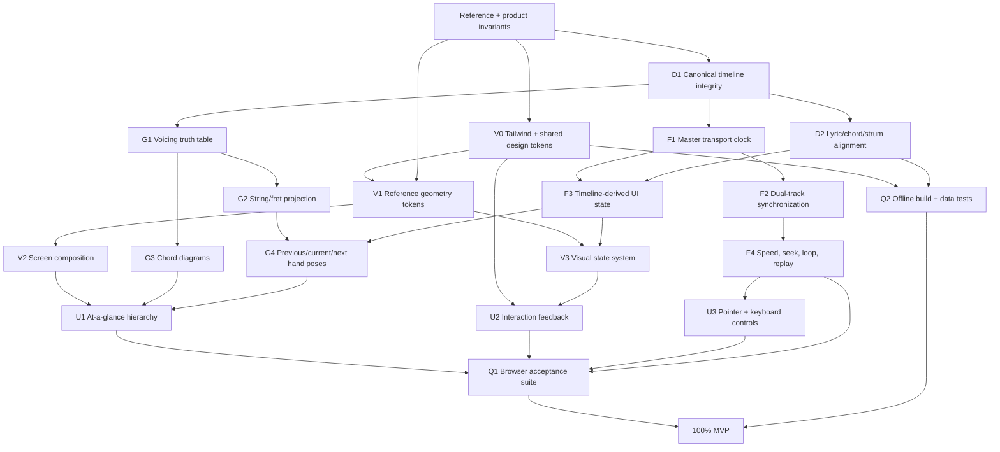

# GuitarFlow MVP Engineering Graph

## Definition of 100%

This document is the acceptance contract for the one-song, 30-second Chord Mode feasibility MVP. A score of 100 means every required node below has passed with reproducible evidence. Scores are not awarded for partially implemented controls, plausible-looking finger positions, or behavior that works at only one playback speed.

The supplied image at `design/reference/guitarflow-chord-mode-reference.png` is the visual source of truth. Song-specific content may differ, but layout hierarchy, visual weight, spacing rhythm, state treatment, fretboard orientation, control placement, and interaction behavior must match its intent.

### Hard release gates

The MVP is not 100% if any one of these gates fails:

1. One backing-audio master drives an output-latency-compensated presentation clock for lyrics, chords, fixed-bar strum guidance, hand states, and transport.
2. Both audio tracks stay within 45 ms at 100%, 75%, and 50% speed.
3. Every displayed chord has a validated six-string voicing and matching finger markers.
4. Hero and tab views place high `e` at the top and low `E` at the bottom; standard chord boxes place low `E` at the left and high `e` at the right.
5. Previous, current, and next states agree across lyrics, tab cards, fretboard, diagrams, and transport.
6. Every visible enabled control works, including keyboard controls and the final loop boundary.
7. The complete practice experience is usable on one desktop screen without horizontal overflow.
8. No new Klangio request is required to build, test, or run this fixture.
9. The styling framework, shared design tokens, and reusable control treatments must compile in the production build; the visual layer cannot depend on scattered one-off inline styles.

### Styling framework implementation points

1. Tailwind CSS is integrated through the official Vite plugin and participates in both development and production builds.
2. Canvas, surface, ink, muted, border, accent, font, and elevation values are defined once in the Tailwind `@theme`/CSS token layer.
3. App-wide states and reusable surfaces use Tailwind utilities or `@apply`; precision fretboard projection remains custom CSS because it is geometry, not generic component styling.
4. Header controls, transport actions, cards, sliders, selected states, hover, focus, and disabled states share one warm studio-instrument visual language.
5. Framework adoption must preserve the one-page 1280 × 720 composition, the 1920 px reference hierarchy, fret/string alignment, accessibility names, and all functional tests.

## Weighted score

| Category | Points | 100% acceptance |
|---|---:|---|
| V — Look and visual fidelity | 25 | All V nodes pass at the reference viewport and desktop minimum viewport. |
| F — Functionality and synchronization | 25 | All F nodes pass at 100%, 75%, and 50%. |
| G — Guitar, voicing, and hand alignment | 20 | All G nodes pass for G, C, D, and Em. |
| U — UI/UX and accessibility | 15 | All U nodes pass by keyboard and pointer. |
| D — Data and musical integrity | 10 | All D nodes pass from immutable cached artifacts. |
| Q — Engineering quality | 5 | All Q checks are automated and green. |
| **Total** | **100** | **Every node and every hard release gate passes.** |

No weighted partial score can override a hard release gate. The live score is `passed points / 100`; a node earns either all its points or zero.

## Dependency graph

## Node acceptance criteria

### V — Look and visual fidelity: 25 points

| ID | Pts | Acceptance test | Evidence |
|---|---:|---|---|
| V1 | 4 | Tailwind `@theme` plus the shared CSS token map cover background, text, inactive gray, orange, radii, borders, shadows, typography scale, and spacing. Orange is reserved for current/action state. | Framework configuration and CSS token audit. |
| V2 | 7 | At 1920 px wide, header, lyrics/context, fretboard hero, and lower controls follow the reference proportions. Fretboard is the largest visual anchor. No horizontal overflow at 1180 px. | Reference and implementation screenshots. |
| V3 | 4 | Past is faint, Now is dominant, Next is ghosted; the same hierarchy is used in tab cards, finger markers, lyrics, strums, and diagrams. | Screenshots at three timeline positions. |
| V4 | 4 | Header is quiet and compact; framework-backed controls use consistent heights, labels, borders, elevation, interaction states, and spacing. No debug badges or unexplained controls appear in the primary hierarchy. | Screenshot and DOM audit. |
| V5 | 3 | Typography, card geometry, whitespace, and alignment are internally consistent and visually close to the reference. | Overlay/difference review. |
| V6 | 3 | Fretboard image, transparent hand, strings, frets, markers, labels, and playhead remain crisp and aligned at target viewport. | Hero crop at G/C/D/Em states. |

### F — Functionality and synchronization: 25 points

| ID | Pts | Acceptance test | Evidence |
|---|---:|---|---|
| F1 | 4 | Backing audio is the only master clock. Every instructional state is derived from its `currentTime` through one speed-aware audio-output-latency compensation; no independent UI timers exist. | Code inspection and master/presentation state trace. |
| F2 | 5 | Backing and guitar tracks remain within 45 ms during play, seek, loop, and speed changes at all three speeds. | Browser drift samples. |
| F3 | 4 | Play/pause, timeline seek, previous/next chord, restart, and replay from end work and update both tracks. | Browser matrix. |
| F4 | 4 | Phrase selection, loop toggle, current-phrase selection, and all four phrase boundaries loop cleanly at all three speeds. | 12-case loop matrix. |
| F5 | 3 | Original/Practice switching and 0–100% guitar level produce the expected effective guitar level without desynchronizing. | DOM/media-state trace. |
| F6 | 3 | Space, L, Left, Right, Plus, and Minus keyboard shortcuts work without hijacking form controls. | Keyboard matrix. |
| F7 | 2 | Loading, playback rejection, missing model, and audio end states are understandable and recoverable. | Forced-state checks. |

### G — Guitar, voicing, and hand alignment: 20 points

| ID | Pts | Acceptance test | Evidence |
|---|---:|---|---|
| G1 | 4 | Data, tab cards, hero labels, and projection code use `e B G D A E` top-to-bottom; chord boxes deterministically reverse this to standard player-facing `E A D G B e` left-to-right. | Automated invariant test. |
| G2 | 5 | G, C, D, and Em frets and standard beginner finger numbers are correct; open and muted strings are distinguished. | Voicing truth-table tests. |
| G3 | 5 | Each fretted marker center lands on the correct string centerline and inside the correct fret cell. Maximum projection error is 3 px at the reference viewport. | Geometry test and hero crops. |
| G4 | 3 | Current markers are orange/clear, previous are faint, next are outlined/ghosted, with no ambiguity or overlap that changes meaning. | Timeline screenshots. |
| G5 | 3 | Transparent hand is guidance only: it does not contradict the selected chord, obscure string labels, or imply false finger contact. | Visual review at all voicings. |

### U — UI/UX and accessibility: 15 points

| ID | Pts | Acceptance test | Evidence |
|---|---:|---|---|
| U1 | 4 | Within three seconds the screen answers: what now, where, when to change, the visible strum pattern, the next/now stroke instruction, what chord comes next, and how to control practice. | Heuristic review tied to labeled regions. |
| U2 | 3 | Enabled controls have visible hover/focus/pressed/disabled states and correct accessible names. Disabled fixture controls clearly communicate why. | Pointer/keyboard and accessibility snapshot. |
| U3 | 3 | Timeline and guitar-level sliders work by pointer and keyboard and expose their current values. | Browser matrix. |
| U4 | 3 | Current lyric/chord/fixed-bar strum/hand state changes together from the audible-presentation clock with no stale mixed state after seeking or chord navigation. | Cross-widget assertions. |
| U5 | 2 | The overflow menu is useful, dismissible, does not cover primary controls, and adds no dead action. | Browser interaction and screenshot. |

### D — Data and musical integrity: 10 points

| ID | Pts | Acceptance test | Evidence |
|---|---:|---|---|
| D1 | 3 | Chord and strum events are sorted, bounded by 0–30 s, and chord intervals are continuous after analyzed pre-roll. | Data validation test. |
| D2 | 3 | All 39 ASR words have bounded timings and current/previous/next chord context; segment text is derived from those words; chord events inside a word are positioned continuously from their exact timestamp instead of inventing phoneme/letter timing that ASR did not provide. | Data validation and continuous chord-anchor tests. |
| D3 | 2 | The UI explicitly distinguishes provider chord identity from GuitarFlow beginner voicing and does not claim unavailable extensions. | Model and copy audit. |
| D4 | 2 | Klangio and lyric artifacts are immutable, cache-verifiable, and runtime playback performs no provider call. | Offline cache verification. |

### Q — Engineering quality: 5 points

| ID | Pts | Acceptance test | Evidence |
|---|---:|---|---|
| Q1 | 2 | Automated tests cover data invariants, voicings, projection math, timeline context, and cache behavior. | Test output. |
| Q2 | 1 | TypeScript and the Tailwind-enabled production build pass with no warnings introduced by app code. | Build output. |
| Q3 | 1 | Browser console has no runtime errors and all local assets load. | Fresh-session browser log. |
| Q4 | 1 | Acceptance evidence and remaining limitations are recorded without claiming unverified accuracy. | This graph and evidence log. |

## Execution substeps

Status values: `TODO`, `DOING`, `PASS`, `BLOCKED`.

| Step | Depends on | Status | Deliverable |
|---|---|---|---|
| 1. Freeze the measurable rubric and reference viewport | — | PASS | This document. |
| 2. Record baseline geometry, states, and browser behavior | 1 | PASS | Baseline: 51/100 before graph-driven corrections. |
| 3. Centralize visual tokens and reference proportions | 2 | PASS | Tokenized CSS and proportional 1265 px composition. |
| 4. Centralize timeline selectors and transport actions | 2 | PASS | `lessonModel.ts` owns the tested runtime selectors. |
| 5. Build a single fretboard projection model | 2 | PASS | Shared calibrated fret/string geometry. |
| 6. Validate G/C/D/Em voicings and diagrams | 5 | PASS | Ten frontend invariants plus backend truth-table tests. |
| 7. Make lyric caret, chord context, strum, and hand states move from one clock | 4, 5 | PASS | Four-chord cross-widget browser matrix. |
| 8. Match header, lyric/context, hero, and lower-control composition | 3, 7 | PASS | Reference geometry and hierarchy pass at 1920 px and 1265 px. |
| 9. Complete transport, loop, mix, keyboard, and failure paths | 4 | PASS | Full interaction matrix and forced failure checks. |
| 10. Run data/cache integrity audit | 4, 6 | PASS | Both Klangio caches and lyric cache verified network-off. |
| 11. Run 1920 px visual regression and 1180 px minimum-width review | 8, 9 | PASS | Fixed-viewport harness and minimum-width browser review pass without overflow. |
| 12. Close every failed node and publish final score/evidence | 6–11 | PASS | 100/100 evidence recorded below and in `design/acceptance/README.md`. |
| 13. Integrate the styling framework and elevate the shared visual system | 3, 8, 11 | PASS | Tailwind Vite integration, theme tokens, reusable premium controls, and refreshed viewport evidence. |
| 14. Clarify chord-box orientation and live strumming instruction | 6, 7, 13 | PASS | Standard low-E-left chord boxes, live pattern steps, current/next stroke cue, countdown, and removal of the non-functional fretboard line. |
| 15. Unify lyric and chord-change timing | 7, 9, 14 | PASS | One shared presentation time for lyrics/cards/fretboard/diagrams plus tested continuous timestamp anchors at 50% speed. |
| 16. Compensate audible output latency and stabilize the strum bar | 15 | PASS | Speed-aware presentation clock with optional device adjustment; fixed beginner bar driven by beat-one phase and one looping orange position line. |
| 17. Repair window-edge chord timing and clarify the bar pattern | 16 | PASS | Canonical chord boundaries reconcile to the cached beat grid without modifying raw Klangio artifacts; the coach visibly holds the six-stroke `D D U U D U` sequence while only its active position advances. |
| 18. Lock the visual stroke phase to the recording and make Practice guitar-free | 17 | PASS | The fixed figure advances on sixteenth-note subdivisions (1.25 s per cycle at 96 BPM), the default audible-display compensation is 140 ms, and Practice mode hard-mutes the guitar stem. |

## Baseline rule

The existing app does not inherit a score from previous work. Each node remains unscored until its evidence test is run against this graph. The first audit establishes the honest baseline; subsequent work closes nodes in dependency order.

## Current score

| Category | Baseline | Current | Remaining gate |
|---|---:|---:|---|
| V — Look and visual fidelity | 4/25 | 25/25 | None. |
| F — Functionality and synchronization | 21/25 | 25/25 | None. |
| G — Guitar, voicing, and hand alignment | 12/20 | 20/20 | None. |
| U — UI/UX and accessibility | 7/15 | 15/15 | None. |
| D — Data and musical integrity | 5/10 | 10/10 | None; transcript remains correctly labeled automatic/candidate. |
| Q — Engineering quality | 2/5 | 5/5 | None. |
| **Total** | **51/100** | **100/100** | **All measurable engineering gates pass.** |

## Evidence log

| Date | Node(s) | Result | Evidence / notes |
|---|---|---|---|
| 2026-08-18 | 1 | PASS | Rubric and graph created from PRD, UI spec, feasibility spec, and supplied visual reference. |
| 2026-08-18 | G1–G4, Q1 | PASS | Replaced equal fret spacing with asset-calibrated perspective boundaries; ten Vitest checks pass for projection, G/C/D/Em voicings, timeline state, and data invariants. |
| 2026-08-18 | D1–D2 | PASS | Repaired one zero-duration ASR cue and segment/word boundary mismatch in the derived canonical model without altering cached raw transcripts. |
| 2026-08-18 | F2, F4 | PASS | 12/12 phrase × speed loop cases passed; measured maximum two-track drift was 0 ms in the sampled matrix. |
| 2026-08-18 | F3, F5, F6 | PASS | Seek, play/pause, chord navigation, restart, replay, 0–100% mix, Original/Practice restore, and all keyboard shortcuts passed. |
| 2026-08-18 | F7 | PASS | Forced missing-model and missing-audio tests displayed Retry and Dismiss recovery actions; temporary test paths were restored. |
| 2026-08-18 | D4 | PASS | 30-second and 15-second Klangio caches plus automatic lyric cache verified complete with `KLANGIO_NETWORK_ENABLED=false`. |
| 2026-08-18 | V1, V3–V4, V6, U1–U5 | PASS | Reference-scaled 1265 px layout has no horizontal overflow; active word caret, chord, strum, diagrams, and calibrated hand markers agree at G/C/D/Em states. |
| 2026-08-18 | V2, V5 | PASS | The fixed 1920 × 1920 harness matches all major reference anchors within 14 px and dimensions within 5%; exact measurements are in `design/acceptance/README.md`. |
| 2026-08-18 | Completion audit | PASS | 12/12 loop cases, clean-session sync/state smoke test, 11 frontend tests, 12 backend tests, production build, cache verification, no overflow, and zero browser runtime errors. |
| 2026-08-18 | V0, V1, V4, V5, Q2 | PASS | Added Tailwind through the official Vite plugin, centralized warm studio tokens, framework-backed surface/control states, and refined sliders/elevation. The live full-page capture equals the 1280 × 720 viewport, playback state remains synchronized, 11 frontend tests and 12 backend tests pass, and the Tailwind production build is clean. |
| 2026-08-18 | G1, U1, V5 | PASS | Removed the decorative fretboard playhead; chord-context boxes render `E A D G B e` left-to-right with upright finger numbers; the live Strum Coach exposes a nine-stroke pattern plus current/next instruction and timing. Verified at 1280 × 720 with no added page height. |
| 2026-08-18 | F1, F3, U4, D2 | PASS | Removed the separate 100 ms lyric lead. Lyrics, NOW card, fretboard, and chord-context diagram derive from one presentation timestamp; intra-word chord labels use continuous event position rather than guessed letter/phoneme timing. |
| 2026-08-18 | F1–F3, U1, U4, D1 | PASS | Added conservative output-device latency detection/default and converted wall latency by playback speed before deriving instructional state. Replaced changing provider-event slices with a fixed beat-grid strum bar whose pattern remains stable while only one active position moves. |
| 2026-08-18 | F1–F3, U1, U4, D1–D2, Q1–Q2 | PASS | Audited the guitar stem around the 15 s cache seam: the strongest harmonic transition occurs at 15.38–15.41 s and cached beat one is 15.35 s, while the second Klangio window had forced D to 15.000 s. The derived model now closes G and starts D at 15.350 s while preserving every raw artifact. At 50%, the live app shows the D marker 29.07% through “road,” NOW and chord context both show D Major, and the coach presents exactly `D D U U D U` with one active indicator. Fifteen frontend tests, 14 backend tests, and the production build pass. |
| 2026-08-18 | F1–F3, F6, U1, U4, Q1–Q2 | PASS | Guitar-stem onset analysis showed the visible bar was running at half the recorded rhythm: the song repeats the eight-slot `D – D U – U D U` figure over two beats, not four. The live 50% browser audit now maps the six recorded attacks at 15.35/15.68/15.85/16.17/16.33/16.46 s to `D/D/U/U/D/U`, keeps exactly one orange indicator, and reports Practice guitar level 0 with `GUITAR TRACK OFF`. Raised the default audible-display compensation from 90 ms to 140 ms for the remaining lyric lead. Fifteen frontend tests, 14 backend tests, and the production build pass. |
