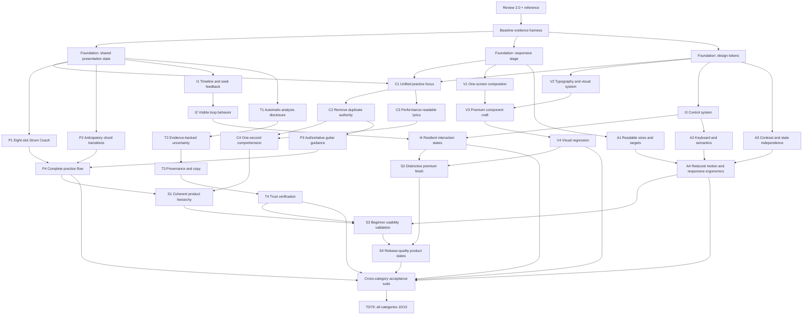

# GuitarFlow Sellability Engineering Graph 2.0

## Mission

This is the implementation and acceptance contract for turning the current 30-second GuitarFlow Chord Mode MVP into a clear, trustworthy, desirable practice product. Version 1 proved technical feasibility. Version 2.0 must make the experience understandable in under one second while preserving musical correctness, cached-data integrity, playback behavior, and the one-screen practice constraint.

The release target is **10/10 in every sellability scorecard category**. A category reaches 10 only when all of its weighted nodes and hard gates pass with reproducible evidence. Visual resemblance, plausible behavior, or a passing build alone cannot earn sellability credit.

Primary references:

- Running product: `http://localhost:5173/`
- Product reference: `design/reference/guitarflow-chord-mode-reference.png`
- Previous technical graph: `ENGINEERING_GRAPH.md`
- UI/UX review source: the eight-part GuitarFlow Sellability UI/UX Review

## Baseline and target

| Category | Reviewed baseline | 2.0 target | Gap |
|---|---:|---:|---:|
| Clarity | 5.5/10 | 10/10 | 4.5 |
| Practice usefulness | 6.5/10 | 10/10 | 3.5 |
| Visual polish | 6.0/10 | 10/10 | 4.0 |
| Interaction quality | 6.0/10 | 10/10 | 4.0 |
| Accessibility | 4.0/10 | 10/10 | 6.0 |
| Trust | 5.0/10 | 10/10 | 5.0 |
| Sellability | 4.5/10 | 10/10 | 5.5 |
| **Total** | **37.5/70** | **70/70** | **32.5** |

The baseline is an audit result, not implementation credit. All 2.0 nodes begin unpassed and must be revalidated against this graph. Existing working behavior is protected through regression gates.

## Status and scoring rules

Statuses: `TODO`, `DOING`, `REVALIDATE`, `PASS`, `OWNER_ACCEPTED`, `FAIL`, `BLOCKED`.

1. Every scored node is binary: all assigned points or zero.
2. A category score is the sum of its passed node points.
3. A category cannot report 10/10 while any linked hard release gate is failing.
4. No node inherits PASS from Engineering Graph 1.0.
5. Evidence must include the exact viewport, product state, playback speed, timestamp, and test method.
6. Subjective review is required for desirability, but it cannot replace measurable geometry, timing, contrast, keyboard, or media-state evidence.
7. The total release score is 70/70 only when every node and every hard gate passes.
8. `OWNER_ACCEPTED` counts as PASS only for this personal-use release and must link to an explicit owner decision; it cannot be represented as external participant evidence.

## Hard release gates

The 2.0 release is blocked if any gate fails:

| Gate | Requirement |
|---|---|
| H1 — One-second comprehension | In an unprompted five-second test, at least 4 of 5 beginner players identify current chord, current hand action (strum or MISS motion), and next chord; median identification time is at most one second per item after orientation. |
| H2 — Unified clock | Lyrics, chord, fretboard, chord diagram, strum state, and timeline derive from one output-latency-compensated presentation timestamp and differ by no more than one animation frame. |
| H3 — Strum truth | The visible grid shows all eight sixteenth-note slots, including two non-contact hand motions, and completes one cycle in 1.25 seconds at 96 BPM; one time-signature-aware count-in bar and the clearly audible optional metronome use the same tempo. |
| H4 — Audio truth | Backing and guitar tracks remain within 45ms after play, seek, speed change, mode switch, and loop wrap at 50%, 75%, and 100%. |
| H5 — Practice mode | Practice sets guitar-stem gain to exactly 0; Original restores it to 1 without seeking, restarting, or changing speed. |
| H6 — One-screen desktop | No horizontal or vertical page scroll exists at 1280 × 720 or 1920 × 1080. All primary practice cues and controls remain visible. |
| H7 — Readability | Current lyric is at least 22px at 1280; current chord at least 28px; utility labels and strum counts at least 11px; normal text contrast is at least 4.5:1. |
| H8 — Ergonomics | Every interactive target is at least 44 × 44px, visibly focused by keyboard, and has an accessible name. |
| H9 — Musical guidance | G, C, D, and Em voicings, string order, finger numbers, chord diagrams, capo-relative projection, and fretboard markers remain correct and share one authoritative mapping. |
| H10 — Responsive priority | The product has intentional layouts for at least 1440+, 1024–1439, 768–1023, and below 768px; it does not rely on a 1080px body minimum. |
| H11 — Trust | Automatic analysis is disclosed in the primary product surface; uncertainty is shown only when supported by data; every published lesson has a passing structural and cached-guitar-audio quality gate with zero unresolved musical findings. |
| H12 — Quality | Production build, automated tests, clean-session browser checks, asset loading, reduced-motion behavior, and visual regression all pass. |

Current gate status: H2–H12 pass after full automated, build, cache, and live-browser revalidation of the count-in, merged guidance, continuous hand motion, publication QA, and capo projection. For this personal-use release, the product owner explicitly waived external beginner testing and directed full assumed H1/C4/S3 credit; the provenance is recorded in `design/acceptance/2.0/final/product-owner-acceptance.md`. H1 is therefore `OWNER_ACCEPTED`, not represented as a completed five-person study. Protocol 2.0.3 remains available for optional future Simple English/Hindi validation. The synchronization audit removed an erroneous 140ms visual-delay floor, verified the browser's measured 10ms compensation, preserved all five provider C intervals, and added a disclosed reviewed C override at 14.11s for the Klangio miss audible at “fork/stuck.” The acoustic publication gate independently rediscovers that raw miss and reports zero unresolved findings after the reviewed correction.

## Dependency graph



## Foundation nodes

Foundation nodes are not separately scored. They enable scored work and protect the existing musical implementation.

| ID | Status | Implementation subpoints | Pass evidence |
|---|---|---|---|
| B0 | PASS | Capture reference, 1280 rest/playback/seek/loop/mode states, 1920 states, computed typography, control bounds, overflow, focus order, media gain, drift, and current score ledger. | Initial baseline and 1280 evidence are recorded under `design/acceptance/2.0/`; remaining target-state artifacts are routed to their scored nodes. |
| F1 | PASS | Keep one backing master; expose typed presentation state for lyric, chord, next-change countdown, fretboard, diagram, strum subdivision, seek preview, and loop phase; prohibit component-local timing. | `getPresentationState` plus 57 boundary cases and the 15-case live transition trace pass. |
| F2 | PASS | Replace fixed desktop squeeze/min-width behavior with named responsive stage modes; define content max width, row priorities, and overflow ownership. | 1920, 1024, 834, and 390 live viewport matrix passes; see `design/acceptance/2.0/responsive/`. |
| F3 | PASS | Consolidate canvas, surface, ink, muted, border, accent, warning, type, spacing, radius, elevation, icon, state, and motion tokens; eliminate conflicting legacy overrides. | The legacy override stack was replaced by one 2.0 token/style layer; production build passes. |

## Scorecard implementation nodes

### C — Clarity: 10 points

| ID | Pts | Status | Implementation subpoints | 10/10 evidence |
|---|---:|---|---|---|
| C1 — Unified practice focus | 3 | PASS | Keep lyrics in one uninterrupted primary lane; use its spare right-side space for a secondary frameless all-song chord/fingering reference and numbered-hand key; merge current chord, continuous hand action, next chord, and countdown into one compact text-only fretboard guidance cluster immediately below it. | Updated 1280 rest/playback/preparation captures show the lyric lane, four-shape chord reference, hand key, and adjacent text-only NOW/HAND/NEXT cluster without scrolling; the current reference follows the live chord. |
| C2 — Remove duplicate authority | 2 | PASS | Select the fretboard plus the all-song reference as authoritative finger guidance; keep NOW/NEXT text-only; remove redundant fretboard footer labels, PAST tab card, decorative music tile, and nonfunctional favorite. | Live DOM reports zero diagrams in NOW/HAND/NEXT, zero PAST cards, four unique song shapes, and one active reference; duplicate lower card and footer are removed. |
| C3 — Performance-readable lyrics | 2 | PASS | Set current lyric to 22–24px at 1280 and 26px at 1920; next lyric to 18–20px; keep one current and one next line; preserve continuous timestamp marker without claiming phoneme precision. | At 1280, computed current/next sizes are 22/18px; continuous chord-anchor test and playback capture pass. |
| C4 — One-second comprehension | 3 | OWNER_ACCEPTED | Test NOW chord, HAND action, NEXT chord, play state, and Guitar on/off recognition with beginners; revise until threshold passes. | Full credit is assumed under the documented personal-use product-owner waiver; no external participant result is claimed. |

### P — Practice usefulness: 10 points

| ID | Pts | Status | Implementation subpoints | 10/10 evidence |
|---|---:|---|---|---|
| P1 — Eight-slot rhythm truth | 3 | PASS | Render `1 e & a 2 e & a` and `D · MISS · D U · MISS · U D U`; preserve equal slot widths; show the up/down hand motion through both non-contact slots; drive one continuous playhead from musical phase; show current and next action text. | Live DOM shows eight equal slots, two directional MISS actions, and one playhead; tests verify continuous motion, 1.25s cycle, and cached attack mapping. |
| P2 — Anticipatory transitions | 2 | PASS | Promote next chord 600–800ms before boundary; show countdown; switch lyric, chord, fretboard, and diagram in one frame; continue strum phase unless the bar restarts musically. | G/C/D/Em plus the reviewed 14.11s C boundary pass before/at/after at 50%, 75%, and 100%; 57 automated boundary cases pass. |
| P3 — Authoritative guitar guidance | 2 | PASS | Show current solid markers only during normal playback; next-position rings only in preparation window; remove previous markers; label Player view; use identical finger numbers/colors in diagram and fretboard; project relative shapes above a visible capo. | G/C/D/Em and capo-relative voicing/projection tests plus live screenshots pass; unsupported or out-of-range shapes render no invented markers. |
| P4 — Complete practice flow | 3 | PASS | Rest state says Ready; Play begins with one 3/4 or 4/4 count-in bar when metronome is on; playback guides now/next; seek and loop remain coherent; Practice is guitar-off; Original restores guitar; loading/end/error paths remain recoverable. | Full state browser suite plus count-in/metronome on/off checks pass under `design/acceptance/2.0/states/`. |

### V — Visual polish: 10 points

| ID | Pts | Status | Implementation subpoints | 10/10 evidence |
|---|---:|---|---|---|
| V1 — One-screen composition | 3 | PASS | Use a 72px header, approximately 150px lyric lane, approximately 240px guitar stage, and remaining-height practice dock; cap wide content at 1760px; give instruction space priority over transport whitespace. | Exact 1280 and 1920 geometry plus the merged guidance cluster pass without overlap or overflow. |
| V2 — Typography and color discipline | 2 | PASS | Apply defined type hierarchy; use `#211E1B` primary ink, `#665F57` secondary, `#F5F1EB` canvas, `#FFFCF8` surfaces, `#DED5CB` borders, and `#E9782F` only for current action. | Computed type and contrast audit passes at both desktop targets. |
| V3 — Premium component craft | 2 | PASS | Standardize 10px controls, 16px modules, restrained border/elevation, one rounded 2px-stroke icon family, optical alignment, selected/hover/focus/disabled states, and remove faux-disabled controls. | State suite and pixel review show one control/icon language, complete focus/pressed states, and zero faux-disabled controls. |
| V4 — Visual regression | 3 | PASS | Match reference hierarchy and visual weight without copying its inefficient vertical length; verify rest, playback, preparation, seek, loop, Original, Practice, uncertain, loading, and error states. | Complete named screenshot suite passes at desktop and all responsive modes. |

### I — Interaction quality: 10 points

| ID | Pts | Status | Implementation subpoints | 10/10 evidence |
|---|---:|---|---|---|
| I1 — Timeline and seek preview | 3 | PASS | Add timestamp/chord/lyric seek tooltip; update all visual cues within 50ms while dragging; commit audio on release; resume only if previously playing. | Paused preview/commit and active keyboard-seek traces pass from the unified synchronous selector. |
| I2 — Visible loop behavior | 2 | PASS | Draw selected loop interval on timeline; show phrase name and exact range without opening menu; preserve correct strum phase; wrap within 40ms without stale end state. | Four phrases × three speeds pass with exact ranges, clamped post-wrap state, and one-frame wrap handling. |
| I3 — Control system | 2 | PASS | Keep Speed, Loop, and Metronome active; convert Mode/Difficulty to metadata and show capo state; provide ≥44px targets, consistent icons, tooltips, selected states, and explicit `Original · Guitar on` / `Practice · Guitar off`. | All default and overflow targets are at least 44 × 44; names, selected states, count-in cancellation, mode copy, and gains pass. |
| I4 — Resilient states | 3 | PASS | Preserve playhead and mode through control changes; prevent accidental restart; provide clear loading, playback rejection, missing asset, end, and retry behavior; remove dead controls. | Loading, model/audio failure, playback rejection, end/replay, speed, mode, seek, and loop states are recoverable. |

### A — Accessibility: 10 points

| ID | Pts | Status | Implementation subpoints | 10/10 evidence |
|---|---:|---|---|---|
| A1 — Readability and ergonomics | 2 | PASS | Enforce minimum type sizes, line heights, target bounds, spacing, zoom resilience, and no clipped text at 200% browser zoom. | Computed sizes/targets and 640 × 360 CSS-pixel 200% equivalent top/bottom captures pass. |
| A2 — Keyboard and semantics | 2 | PASS | Logical focus order: header → lyric/guidance focus → coach → transport; preserve Space/L/arrows/plus/minus shortcuts outside form controls; add names, roles, values, and tooltips. | DOM focus order, visible focus capture, names, values, metronome state, tooltips, shortcuts, and form isolation pass. |
| A3 — Contrast and non-color state | 3 | PASS | Meet WCAG AA; distinguish current, next, loop, Practice, focus, and uncertainty with text, borders, shapes, or icons as well as color. | All normal-text pairs are 4.89:1 or higher; every named state has non-color communication. |
| A4 — Reduced motion and responsive ergonomics | 3 | PASS | Honor `prefers-reduced-motion`; snap rather than interpolate timed markers; maintain meaning across all four responsive modes; make mobile transport reachable without covering lyrics. | Reduced-motion rules and four-mode viewport matrix pass; mobile transport remains in flow. |

### T — Trust: 10 points

| ID | Pts | Status | Implementation subpoints | 10/10 evidence |
|---|---:|---|---|---|
| T1 — Automatic-analysis disclosure | 2 | PASS | Add restrained `Auto analysis` metadata beside song identity; retain detailed Klangio/ASR/cache information in overflow. | Auto analysis is visible in the header; detailed Klangio, ASR, coverage, cache, and compensation information remains in overflow. |
| T2 — Evidence-backed uncertainty | 3 | PASS | Define supported lyric confidence threshold; apply dotted underline/icon only below it; do not invent chord confidence; show unknown/rest state when strum evidence is unavailable. | Threshold tests and uncertain/unsupported/missing-rhythm live fixtures pass. |
| T3 — Provenance and musical copy | 2 | PASS | Distinguish provider chord identity from beginner voicing; explain Practice backing; label Player view and string order; keep cache/offline claims accurate. | Overflow names Klangio cache, Automatic ASR, cached stems, beginner voicings, and Practice backing behavior accurately. |
| T4 — Trust verification | 3 | PASS | Test a deliberately uncertain lyric, unsupported chord, missing stem, cache-only run, raw provider miss, unresolved publication report, and reviewed resolution; ensure the app blocks unsafe lesson publication and degrades honestly. | Forced-state suite, publication-gate tests, raw 14.11s rediscovery, zero-unresolved corrected model, and cache immutability pass. |

### S — Sellability: 10 points

| ID | Pts | Status | Implementation subpoints | 10/10 evidence |
|---|---:|---|---|---|
| S1 — Coherent product hierarchy | 2 | PASS | Deliver the revised top-to-bottom hierarchy; ensure every visible element directly supports the 30-second practice job; remove prototype residue and duplicate explanation. | Engineering review, one-screen captures, and product-owner acceptance confirm the final hierarchy for personal use. |
| S2 — Distinctive premium finish | 2 | PASS | Refine typography, spacing, iconography, fretboard overlays, module proportions, status treatments, and empty/error states into one studio-instrument language. | Final target screenshots pass the 2.0 studio-instrument visual review. |
| S3 — Beginner usability validation | 3 | OWNER_ACCEPTED | Conduct five-second comprehension and complete-task sessions for play, follow strum, identify next chord, enable loop, seek, and enter Practice. | Full task-success credit is assumed under the documented personal-use product-owner waiver; Protocol 2.0.3 remains optional. |
| S4 — Release-quality product states | 3 | PASS | Complete all responsive, accessibility, trust, loading, error, mode, loop, seek, playback, and reduced-motion states; remove debug wording from primary UI. | Complete engineering state suite passes and the owner-accepted S3 dependency is resolved for personal use. |

## Required one-screen hierarchy

This hierarchy is an implementation constraint, not a loose styling suggestion.

| Vertical region | Required contents | Remove or merge |
|---|---|---|
| Header — 72px target | Song/artist; Auto analysis and QA-checked metadata; Speed; Loop; Metronome; overflow. | Remove decorative favorite; convert unavailable Mode/Difficulty controls to metadata; show capo state; no duplicate speed control. |
| Lyric lane — approximately 150px | Current and next lyric with exact chord anchors; count-in/tempo readiness copy. | Remove scattered current-action cards so lyrics gain the full remaining width. |
| Guitar stage — approximately 240px at 1280 | Player-view fretboard; capo; current fingers; preparation rings; one compact text-only NOW/HAND/NEXT guidance cluster. | Keep chord shapes in the lyric-side reference; remove previous fingers and duplicate current/next diagrams. |
| Practice dock — remaining height | Eight-slot Strum Coach; progress; transport; visible loop range; Speed if not in header; Original/Practice state. | Replace two imbalanced lower cards; remove keyboard-shortcut sentence from the main surface. |

At 1920px, extra space increases fretboard and lyric readability before increasing gaps. Content remains centered inside a maximum 1760px stage.

## Design-system implementation contract

| Token group | Required values/behavior |
|---|---|
| Color | Canvas `#F5F1EB`; Surface `#FFFCF8`; Ink `#211E1B`; Secondary `#665F57`; Quiet `#746D65`; Border `#DED5CB`; Current indicator `#E9782F`; Current text/marker `#9A4D1D`; Current surface `#FFF0E5`; Uncertain `#9A632E`. |
| Type | Humanist sans for UI; dedicated monospace for strings/tab; live lyric 24/32 at 1280; current chord 28–32; next chord 18–20; body 14/20; utility minimum 11/14. |
| Spacing | 4px base scale: 4, 8, 12, 16, 24, 32, 40. No arbitrary gaps without a documented geometry reason. |
| Shape | Controls 10px; modules 16px; pills fully rounded; no mixture of circles, squares, and rounded rectangles for equivalent actions. |
| Elevation | Default surface uses border plus `0 8px 24px rgba(42,34,27,.08)`; stronger elevation is reserved for menus/dialogs. |
| Icons | One 20/24px rounded, 2px-stroke family; icon-only controls require tooltip and accessible name. |
| Interaction | 44px targets; 3px orange-tinted focus ring with 2px offset; pressed state uses text/icon/border as well as color; static metadata is not rendered disabled. |
| Motion | 120ms state transitions, 180ms module transitions; continuous motion only for timeline-derived playhead; reduced motion snaps to musical boundaries. |

## Behavior-state contract

| State | Required behavior |
|---|---|
| Rest | Show ready lyrics, all-song shape reference and numbered-hand key, first chord, first hand action, next chord, count-in meter/BPM, current pose, and transport at 0:00; default to 100% and Original. |
| Count-in | With Metronome on, Play schedules one accented bar using 3 or 4 beats from the validated time signature; show the current count; start both media tracks exactly after the final beat. Metronome off bypasses the count-in. |
| Playback | Active lyric/chord/fingers/stroke derive from presentation time; upcoming chord becomes prominent 600–800ms early; one strum playhead moves through all slots. |
| Seeking | Freeze interpolation; preview timestamp, lyric, chord, fingers, and subdivision; commit audio on release; resume only when previously playing. |
| Looping | Show range and phrase label; preserve subdivision phase; wrap without stale state or audio drift. |
| Chord transition | Next preview prepares; all current-state consumers switch in one frame; old markers disappear; strum phase does not reset without a musical reason. |
| Metronome | On emits speed-adjusted beat clicks from the cached beat grid and an accented beat 1; Off silences clicks and bypasses count-in without altering song time or mix mode. |
| Practice | Backing audible; guitar gain 0; state reads `Practice · Guitar off`; no timeline interruption. |
| Original | Backing plus guitar; guitar gain 1; no timeline interruption. |
| Uncertain | Show supported uncertainty treatment without blocking practice; never display invented confidence or unsupported finger data. |
| Failure | Explain missing model/audio/playback failure in plain language; provide Retry or recovery; preserve cached-artifact integrity. |

## Objective acceptance suite

### Desktop geometry and readability

| Test | 1280 × 720 | 1920 × 1080 |
|---|---|---|
| Page overflow | `scrollWidth == innerWidth`; `scrollHeight == innerHeight`. | Same. |
| Content width | Full usable stage with safe 32–40px side padding. | Centered, maximum 1760px. |
| Current lyric | At least 22px. | At least 26px. |
| Next lyric | At least 18px. | At least 20px. |
| Current chord | At least 28px. | At least 32px. |
| Strum direction/count | At least 20px / 11px. | At least 22px / 12px. |
| Interactive target | At least 44 × 44px. | At least 44 × 44px. |
| Primary visibility | Lyric, current chord, fingers, current stroke, next chord, play, speed, loop, and mode all visible. | Same, without cues drifting to opposite screen edges. |
| Bottom-module whitespace | No more than 15% unexplained empty area. | Same. |

### Synchronization and rhythm

1. Sample presentation, lyric, chord, diagram, fretboard, strum, and timeline state before/at/after every chord boundary.
2. Maximum cross-widget disagreement is one animation frame.
3. Verify the eight-slot cycle duration is 1.25s at 96 BPM and both MISS slots preserve the alternating hand direction without a string attack.
4. Verify six stroke offsets within ±40ms at 50%, 75%, and 100%.
5. Verify lyrics and chord changes against audible output with measured device compensation, no artificial minimum, and documented bidirectional adjustment.
6. Verify backing/guitar drift remains under 45ms through seek, speed, mode, and every loop boundary.
7. Verify a 4/4 lesson counts 1–2–3–4 and a 3/4 fixture counts 1–2–3 at the speed-adjusted BPM; Metronome off starts without count-in.

### Interaction and accessibility

1. Pointer and keyboard seek update all preview states within 50ms.
2. Loop track shows exact start/end and wraps within 40ms.
3. Focus order follows header → lyric/guidance focus → coach → transport.
4. Space, L, arrows, plus, and minus do not hijack form controls.
5. Every icon-only control has an accessible name and tooltip.
6. WCAG AA contrast and color-independent state checks pass.
7. At 200% zoom, controls and lyrics remain reachable without clipping.
8. Reduced-motion mode removes interpolation but preserves timing truth.

### Product and trust

1. Auto-analysis disclosure is visible without opening overflow.
2. Low-confidence lyric treatment appears only below the tested threshold.
3. Missing confidence never appears as a fabricated percentage.
4. Unsupported chords do not receive invented finger positions.
5. Practice reports and applies guitar gain 0; Original reports and applies gain 1.
6. Five-second comprehension and task-success thresholds pass.
7. No P0 or P1 review item remains open.
8. A lesson with a missing/failed quality report or unresolved acoustic finding cannot open; corrected lessons retain the raw finding and reviewed resolution.

## Two-pass implementation plan

### Pass 1 — Usable and coherent

| Step | Depends on | Status | Implementation substeps | Deliverable |
|---|---|---|---|---|
| 1. Establish 2.0 baseline harness | — | PASS | Capture all viewports/states; record sizes, targets, overflow, timing, gain, focus, and baseline scores. | Initial evidence pack exists; scored-node evidence expands it during implementation. |
| 2. Consolidate timeline/presentation state | 1 | PASS | Central selectors; next-change countdown; seek preview; loop phase; eliminate local timing. | F1 state API, 57 boundaries, and 15-case live matrix pass. |
| 3. Build responsive stage primitives | 1 | PASS | Max-width stage; named breakpoints; remove 1080px body minimum; define row ownership. | Four-mode live matrix passes. |
| 4. Consolidate 2.0 design tokens | 1 | PASS | Color, type, spacing, radius, elevation, icon, state, and motion tokens; remove legacy conflicts. | F3 token layer and build pass. |
| 5. Build unified practice focus | 2–4 | PASS | Full-width lyric lane; merged NOW/HAND/NEXT fretboard cluster; remove music tile, PAST card, and duplicate cue real estate. | C1 updated focus component and captures pass. |
| 6. Remove duplicated chord authority | 5 | PASS | One active shape in the all-song reference; text-only current/next preview; remove redundant diagrams, readouts, and previous fingers. | C2 DOM inventory passes; P3 chord matrix remains pending. |
| 7. Build metrical Strum Coach | 2, 5 | PASS | Eight equal slots, two directional MISS motions, counts, continuous playhead, current/next actions, one-bar count-in, and audible optional metronome. | P1 component, live phase, count-in, bright two-voice tick, enable-preview, and timing tests pass. |
| 8. Add transition preparation | 2, 6, 7 | PASS | 600–800ms next chord emphasis and rings; atomic boundary swap; uninterrupted phase. | P2 behavior tests and live matrix pass. |
| 9. Rebuild timeline, seek, and loop feedback | 2, 3 | PASS | Seek tooltip; loop range; phrase label; correct resume/wrap behavior. | I1/I2 components and matrices pass. |
| 10. Rebuild control hierarchy | 3–5 | PASS | Metadata vs controls; 44px targets; unified icons; Speed/Loop/Metronome; Practice/Original wording; tooltips. | I3/A1/A2 control audits pass. |
| 11. Complete trust and uncertainty states | 2, 5 | PASS | Auto and QA chips; low-confidence lyrics; unsupported/missing states; provider-miss publication gate; provenance copy. | T1–T4 live states, acoustic audit, and tests pass. |
| 12. Pass usability/accessibility gates | 5–11 | PASS | Contrast, zoom, focus, keyboard, semantics, reduced motion, responsive modes, comprehension test. | A1–A4 pass; C4 receives documented personal-use owner acceptance. |

### Pass 2 — Distinctive and premium

| Step | Depends on | Status | Implementation substeps | Deliverable |
|---|---|---|---|---|
| 13. Refine one-screen composition | 12 | PASS | Tune 72/150/240/remainder regions; rebalance coach and transport; reduce unexplained whitespace. | V1 exact geometry and final dock density pass. |
| 14. Refine type, color, and iconography | 4, 13 | PASS | Optical hierarchy, disciplined accent, contrast, one icon family, clean metadata. | V2/V3 audits and state suite pass. |
| 15. Refine fretboard teaching quality | 6, 8, 14 | PASS | Marker hierarchy, preparation rings, Player view label, diagram correspondence, texture contrast. | P3 voicing tests and four captures pass. |
| 16. Polish complete product states | 9–15 | PASS | Rest/play/seek/loop/mode/uncertain/loading/error/end/reduced-motion states. | I4/T4 engineering state suite and S4 pass. |
| 17. Run beginner task validation | 16 | OWNER_ACCEPTED | Five-second comprehension; count-in/play, continuous-hand strum, next chord, seek, loop, and Practice tasks. | External sessions are waived for this personal-use release and full credit is explicitly assumed by the product owner; Protocol 2.0.3 remains available but no completed cohort is claimed. |
| 18. Run final visual and engineering QA | 16, 17 | PASS | Both target desktops, responsive modes, visual diffs, sync/drift, accessibility, build, tests, console, assets. | Complete engineering pack passes after the final owner-acceptance reconciliation. |
| 19. Score 2.0 release | 18 | PASS | Audit every node and hard gate; attach evidence; list honest limitations. | Personal-use ledger reaches 70/70 with measured engineering evidence plus explicit owner acceptance for human-dependent nodes. |

## Review-section coverage matrix

| Review section | Graph coverage |
|---|---|
| 1. Executive verdict | Mission, baseline, hard gates, S1–S4. |
| 2. Seven-part scorecard | C, P, V, I, A, T, and S node groups; each totals 10. |
| 3. Ten highest-impact problems | C1–C3, P1/P3, V1, I1–I3, A1–A4, T1–T4, F2. |
| 4. Revised one-screen hierarchy | Required one-screen hierarchy, F2, C1/C2, V1, I3. |
| 5. Design-system specification | F3, V2/V3, A1/A3/A4, Design-system contract. |
| 6. Behavior specification | F1, P1–P4, I1/I2/I4, T2/T4, Behavior-state contract. |
| 7. Acceptance criteria | Hard gates and Objective acceptance suite. |
| 8. Two-pass plan | Pass 1 and Pass 2 execution tables. |

## Evidence artifact contract

All 2.0 evidence belongs under `design/acceptance/2.0/`:

```text
design/acceptance/2.0/
├── README.md
├── baseline/
├── geometry/
├── states/
├── responsive/
├── accessibility/
├── synchronization/
├── usability/
└── final/
```

`README.md` must contain the final score ledger, test commands, viewport/device details, maximum measured timing drift, unresolved limitations, and links to every supporting artifact. Screenshots without recorded viewport/state metadata are not acceptance evidence.

## Current 2.0 ledger

| Category | Passed | Target | Status |
|---|---:|---:|---|
| Clarity | 10/10 | 10/10 | C1–C3 pass; C4 is owner accepted for personal use. |
| Practice usefulness | 10/10 | 10/10 | PASS |
| Visual polish | 10/10 | 10/10 | PASS |
| Interaction quality | 10/10 | 10/10 | PASS |
| Accessibility | 10/10 | 10/10 | PASS |
| Trust | 10/10 | 10/10 | PASS |
| Sellability | 10/10 | 10/10 | S1/S2/S4 pass; S3 is owner accepted for personal use. |
| **Total** | **70/70 personal-use release score** | **70/70** | **PASS — measured engineering evidence is complete and human-dependent credit is explicitly owner accepted.** |

The reviewed product baseline remains 37.5/70. The 2.0 ledger combines reproducible engineering evidence with the documented product-owner assumption for H1/C4/S3. It does not claim that an external five-participant study occurred.
